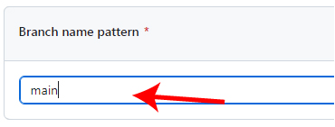
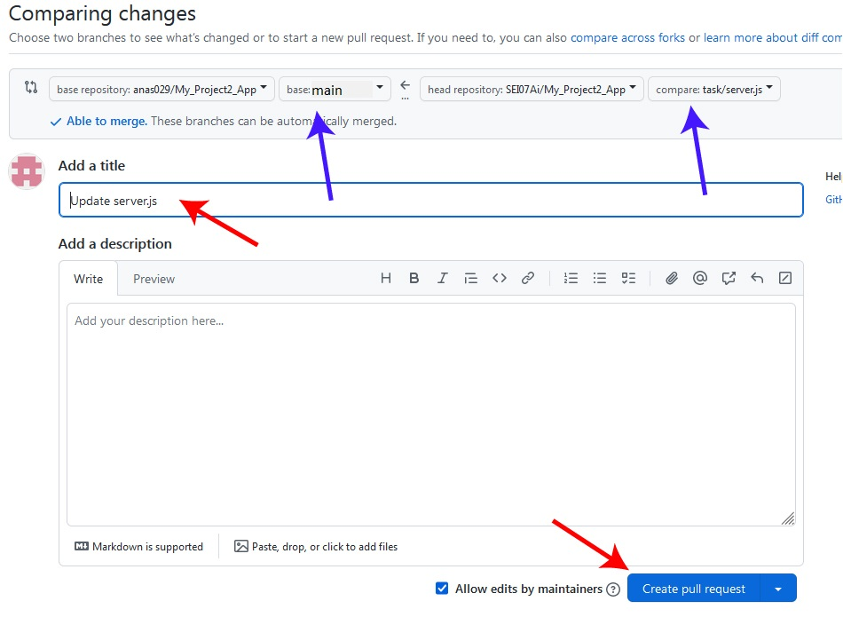

# Step-by-Step Guide for Team Project GitHub Repository


This README provides a comprehensive guide for team leader and team members on setting up, contributing to, and maintaining project.

## 1. Create a Repository: `Team Leader`

1. Navigate to your GitHub account.
2. Click on the '+' icon in the top right corner and select "New repository".

   

3. Fill in the repository name, description, and choose visibility options.
4. Initialize with a README. And gitignore if needed.
5. Click "Create repository."

   

## 2. Set Up Rules: `Team Leader`

1. Click on the "Settings" tab.

   

2. In the left sidebar, click on "Branches".

   

3. Under the "Branch protection rules" section, click on the "Add branch protection rule" button.

   

4. Type "main" in "Branch name pattern"

   

5. Check "Require a pull request before merging"

   

6. Click on "Create".

   

## 3. Clone the Repository: `Team Leader`

1. On your repository, click the "Code" button and copy the repository URL.

   

2. Open your terminal and run:

```bash
git clone <repository_URL>
cd <repository_directory>
```

3. Create a branch for each task or feature using:

```bash
git checkout -b <branch_name>
```

4. To check what branch you are currently in:

```bash
git branch
```

5. Make changes or add new files.

6. Stage, commit and push your changes to the current branch.

```bash
git add -A
git commit -m '<your commit message>'

#Replace your-branch-name with the actual name of your branch.
git push origin your-branch-name
```

If it's the first time pushing this branch

```bash
#Git might suggest the following command:
git push --set-upstream origin your-branch-name
```

## 4. Fork the Repository: `Team member`

1. Visit team leader's repository of the project.

2. Click on the "Fork" button in the top right corner of the repository page and then "Create a new fork".

   

3. Uncheck "Copy the main branch only" and click "Create fork"

   

## 5. Clone the Repository: `Team member`

1. Make sure your are on your repository, click the "Code" button and copy the repository URL.

   

2. Open your terminal and run:

```bash
git clone <repository_URL>
cd <repository_directory>
```

## 6. Add Upstream: `Team member`

We also need to add a Git remote pointing back to the repo you forked, so you can pull changes from it.

1. Open your terminal and run:

```bash
git remote add upstream <team leader repo>
```

Now if you type `git remote -v` in your terminal you can see you have both origin and upstream remote set up that allows you to push and pull changes.

## 6. Create New Branch: `Team member`

You do not just want to work on the master branch, you should create a different branch when you work with other people on the the same repo.

Create new branch:

```bash
git checkout -b <new branch name>
```

Check all the branches: your current branch will show \* before it

```bash
git branch
```

Switch branch:

```bash
git checkout <branch name you want to switch to>
```

## 7. Push Changes: `Team member`

After you are done with your work, **you need to discuss these changes before pushing it to GitHub**

6. Stage, commit and push your changes to the current branch.

```bash
git add -A
git commit -m '<your commit message>'

#Replace <your-branch-name> with the actual name of your branch.
git push origin <your-branch-name>
```

## 8. Create a Pull Request: `Team member`

Once you pushed your changes, GitHub will promote you to create a pull request.

1. Click on "Compare & pull request"

   

2. Make sure you are requesting a pull from the correct branch to main branch. Then, click on "Create pull request"

   

   If there is no conflict you should see a message like this.

   

## 9. Accept Pull Request: `Team Leader`

Team leader will accept the change and merge to the main repo.

1. On your (team leader) project repository, click on "Pull requests".

   

2. Click on the pull request you want to accept and merge.

   

3. If there is no conflict, Click on "Merge pull request".

   

4. Click on "Confirm merge".

   

## 10. Update Local Git repository: `Team Leader`

After merge you want to get the most updated code from your main and the branch you are working on.

1. Move to local branch:

```bash
git checkout <your branch>
```

2. Pull the most up to date code:

```bash
git pull origin main
```

If there are any conflicts you need to resolve them and do `git add` and `git commit` again.

## 11. Update Local Git repository: `Team member`

After a merge is done, you would want to get the most updated code from your your upstream.

1. Move to local branch:

```bash
git checkout <your branch>
```

2. Pull the most up to date code:

```bash
git pull upstream  main
```

If there are any conflicts you need to resolve them and do `git add` and `git commit` again.

Then you can update your origin main:

```bash
git push origin <your branch>
```

### **Iron rule**: Always communicate changes and workflows with your teammates.

### **Golden rule**: Always pull before push.
